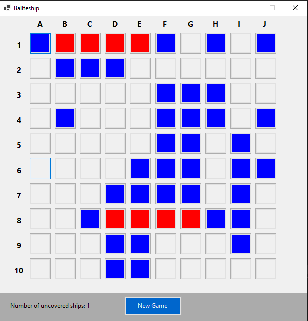

# Battleship game

This is simple 1 player mode [battleship game](https://www.youtube.com/watch?v=q0qpQ8doUp8).
On the board there are 3 ships at random position, player goal is to find and destroy them all ! 

### How to run the project

This is WinForms project, to run it just open solution and run Battleship project
(.NET 6 or higher is required). 

